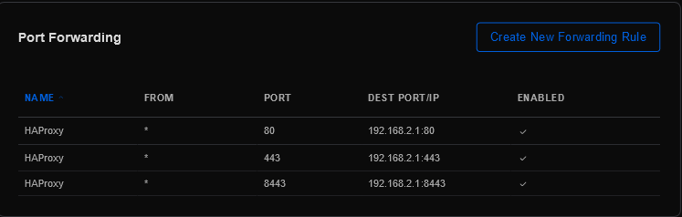
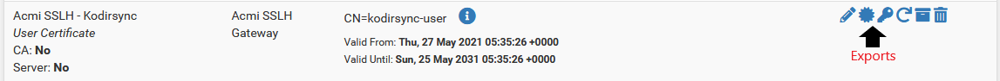
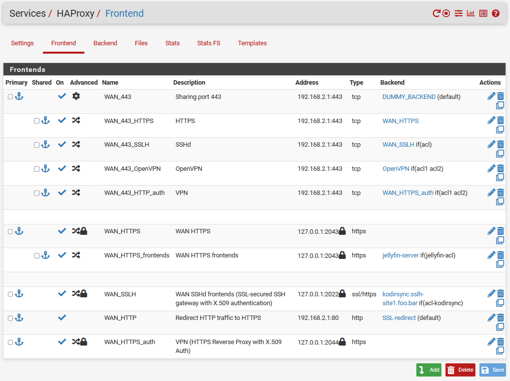
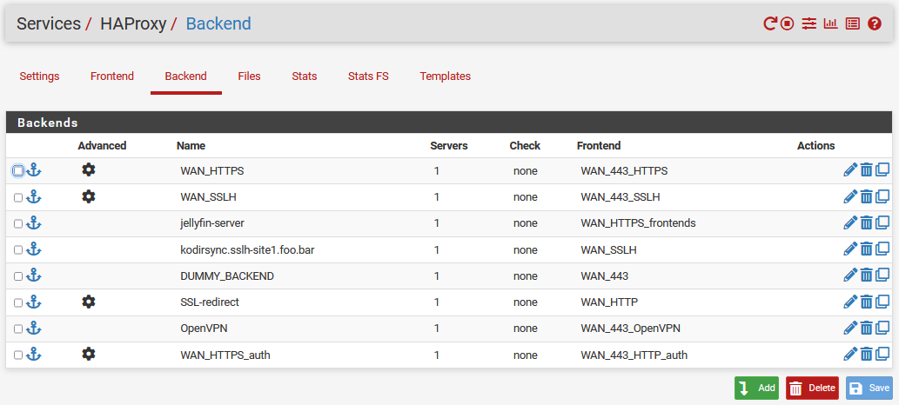

<h1>pfSense HAProxy</h1>

This guide is for pfSense add-on HAProxy.

A reverse proxy server is a type of proxy server that typically sits behind a firewall in a private network and directs client requests to the appropriate backend server. A reverse proxy provides an additional level of abstraction and control to ensure the smooth flow of network traffic between clients and servers.

The easiest way to set up HAProxy is by a pfSense HAProxy add-on.

With HAProxy you will have access to your applications and internal servers using address URLs like:
>  https://unifi-site1.foo.bar --> unifi 192.168.1.251
>  https://jellyfin-site1.foo.bar --> jellyfin.local

Using one public-facing IP address and SSL port 443 you can:
*  route your SSH and Rsync connections to a specific server.
*  add a security layer to restrict the login ability based on client certificates.
*  route your HTTPS connections to a predefined list of backend servers.

For SSH or Rsync we’ll use the TLS protocol and its SNI extension together with the SSH ProxyCommand feature. Or, said another way, we will wrap our connections with TLS, but we do so simply to leverage SNI so that the client can tell us which backend server they want to connect to.  

pfSense package manager has a ready-built distribution of HAProxy.

<h2>Prerequisites</h2>

- [ ] Proxmox hosts fully configured as per guide: [PVE Host Setup](https://github.com/ahuacate/pve-host) (Recommended)
- [x] pfSense is fully configured as per guide: [pfSense Setup](https://github.com/ahuacate/pfsense-setup)
- [x] PiHole DNS server
- [x] You own a registered Domain name

<hr>

<h4>Table of Contents</h4>

<!-- TOC -->

- [1. Create a Cloudflare Account](#1-create-a-cloudflare-account)
- [2. Configure your domains at Cloudflare](#2-configure-your-domains-at-cloudflare)
    - [2.1. Create DNS A records for your servers](#21-create-dns-a-records-for-your-servers)
    - [2.2. Cloudflare SSL/TLS (formerly Crypto)](#22-cloudflare-ssltls-formerly-crypto)
- [3. WAN Gateway Port Forwarding](#3-wan-gateway-port-forwarding)
- [4. pfSense Dynamic DNS](#4-pfsense-dynamic-dns)
    - [4.1. Create pfSense Dynamic DNS entries](#41-create-pfsense-dynamic-dns-entries)
- [5. Install ACME on pfSense](#5-install-acme-on-pfsense)
    - [5.1. ACME General Settings](#51-acme-general-settings)
- [6. Generate ACME Certificates](#6-generate-acme-certificates)
    - [6.1. Create ACME Account Keys](#61-create-acme-account-keys)
    - [6.2. Create ACME Certificates - Media](#62-create-acme-certificates---media)
    - [6.3. Create ACME Certificates - SSLH and VPN](#63-create-acme-certificates---sslh-and-vpn)
        - [6.3.1. SSLH Server Certificate](#631-sslh-server-certificate)
        - [6.3.2. VPN Server Certificate](#632-vpn-server-certificate)
- [7. Creating internal Certificate Authorities and certificates](#7-creating-internal-certificate-authorities-and-certificates)
    - [7.1. Create internal Certificate Authorities (CA's)](#71-create-internal-certificate-authorities-cas)
        - [7.1.1. Create internal certificate for SSLH](#711-create-internal-certificate-for-sslh)
        - [7.1.2. Create internal certificate for VPN](#712-create-internal-certificate-for-vpn)
    - [7.2. Create server certificates](#72-create-server-certificates)
        - [7.2.1. Create server certificate for SSLH](#721-create-server-certificate-for-sslh)
        - [7.2.2. Create server certificate for VPN](#722-create-server-certificate-for-vpn)
    - [7.3. Create user certificates](#73-create-user-certificates)
        - [7.3.1. Create user certificate for SSLH (single user certificate option)](#731-create-user-certificate-for-sslh-single-user-certificate-option)
    - [7.4. Export user CAs and certificates](#74-export-user-cas-and-certificates)
- [8. Configure Firewall Rules](#8-configure-firewall-rules)
- [9. Configure pfSense DNS Resolver Host Overrides](#9-configure-pfsense-dns-resolver-host-overrides)
- [10. HAProxy Setup](#10-haproxy-setup)
    - [10.1. Install HAProxy](#101-install-haproxy)
    - [10.2. HAProxy General Settings](#102-haproxy-general-settings)
    - [10.3. HAProxy Frontend & Backend Settings](#103-haproxy-frontend--backend-settings)
        - [10.3.1. My Working haproxy.cfg](#1031-my-working-haproxycfg)
- [11. Test your HAProxy server](#11-test-your-haproxy-server)
    - [11.1. HTTPS Test](#111-https-test)
    - [11.2. SSLH Test](#112-sslh-test)
- [12. Patches & Fixes](#12-patches--fixes)
    - [12.1. Fix for pfSense Dynamic DNS](#121-fix-for-pfsense-dynamic-dns)
        - [12.1.1. Install a Cron Manager](#1211-install-a-cron-manager)
        - [12.1.2. Configure your Dynamic DNS Cron Schedule](#1212-configure-your-dynamic-dns-cron-schedule)

<!-- /TOC -->
<hr>

# 1. Create a Cloudflare Account
I recommend you redirect your domain DNS Names Servers to Cloudflare.

Cloudflare DNS servers fast, they support a API Key for configuring your pfSense DNS records and provide a **free Dynamic DNS service**. A Cloudflare DNS name server is free for basic home users.

There are plenty of tutorials about how to move your DNS services from Google, GoDaddy, and other providers to Cloudflare on the internet.

This tutorial will refer to Cloudflare DNS management from now on.

# 2. Configure your domains at Cloudflare
First, you must decide on your subdomain names. It’s part of the address used to direct traffic to a particular service running on your site's servers. 

For example, **jellyfin-`site1`.foo.bar** or **jellyfin-`site2`.foo.bar** where **`site1`** and **`site2`** are two different locations (i.e servers) in the world.

## 2.1. Create DNS A records for your servers
First login to your Cloudflare Dashboard Home, choose your domain, and go to `DNS TAB`. You will be provided with a page to `Manage your Domain Name System (DNS) settings`. Using the Cloudflare web interface create the form entries you require by clicking `Add Record` after completing each entry as shown below (add whatever you want):

| Type | Name | IPv4 address | Automatic TTL | Orange Cloud | Notes
| :---: | :---: | :---: | :---: | :---: | :---
| `A` | `sslh-site1` | 0.0.0.0 | `Automatic TTL` | `OFF` | *Note, Uncheck the cloudflare orange cloud for SSH (non-html).*
| `A` | `vpn-site1` | 0.0.0.0 | `Automatic TTL` | `OFF` | *Note, Uncheck the cloudflare orange cloud for SSH (non-html).*
| `A` | `jellyfin-site1` | 0.0.0.0 | `Automatic TTL` | `ON` |
| `A` | `sample-site1` | 0.0.0.0 | `Automatic TTL` | `ON` | *Create for whatever HTTPS service you want - sonarr-site1, radarr-site1 etc.*

The IPv4 address 0.0.0.0 will be updated by your pfSense DDNS service.

## 2.2. Cloudflare SSL/TLS (formerly Crypto)
Using your Cloudflare Dashboard Home, choose your domain and go to `SSL/TLS TAB`. Using the Cloudflare web interface edit the following form entries to match the table below:

| SSL/TLS | Value 
| :---: | :---
| **Overview**
| Your SSL/TLS encryption mode | `Full` | 
| **Edge Certificates**
| Edge Certificates | Leave Default
| Always Use HTTPS | `On`
| HTTP Strict Transport Security (HSTS) | Leave Default
| Minimum TLS Version | `TLS 1.0 (default)`
| Opportunistic Encryption | `On`
| TLS 1.3  | `On`
| Automatic HTTPS Rewrites | `Off`
| Certificate Transparency Monitoring | 'Off'
| Disable Universal SSL | Leave Default (should be enabled)
| **Origin Server**
| Origin Certificates | Leave Default
| Authenticated Origin Pulls | `Off`
| **Custom Hostnames**
| Custom Hostnames | Leave Default

# 3. WAN Gateway Port Forwarding
You must create Port Forward rules from your WAN Gateway device to your pfSense host. Apply the following rules to your WAN Gateway device (shown are UniFi USG rules).

Navigate using the UniFi controller web interface to `Settings` > `Firewall & Security` > `Port Forwarding` and complete as follows.

| Name | From | Port | Dest IP/Port | Enabled | WAN Interface
| :---: | :---: | :---: | :---: | :---: | :---:
| HAProxy | `*` |  `80` |  `192.168.2.1:80` |  ✅ |  `WAN` 
| HAProxy | `*` |  `443` |  `192.168.2.1:443` |  ✅ |  `WAN` 
| HAProxy | `*` |  `8443` |  `192.168.2.1:8443` |  ✅ |  `WAN`



# 4. pfSense Dynamic DNS
Cloudflare provides you with an API key (called the Global API Key) which gives pfSense the rights to update your domain's DNS information. So have your Cloudflare Global API key ready by:
*  Log in to Cloudflare Account and go to your Profile;
*  Scroll down and View your **Global API Key**;
*  Complete the password challenge and note your key.

## 4.1. Create pfSense Dynamic DNS entries
Configure for each HAProxy backend server you want access to (i.e sslh-site.foo.bar, jellyfin-site.foo.bar, sonarr-site.foo.bar etc).

Navigate using the pfSense web interface to `Services` > `Dynamic DNS`. Click `Add` and fill out the necessary fields as follows.

| Dynamic DNS Client | Value
| :--- | :---
| Disable | `☐`
| Service Type | `Cloudflare`
| Interface to monitor | `LAN`
| Hostname | `sslh-site1` followed by `foo.bar`
| Cloudflare Proxy | `☐` Enable Proxy (Only disable for SSH. Otherwise enable for all HTTP servers such sonarr-site1.foo.bar, jellyfin-site1.foo.bar)
| Verbose logging | `☐` Enable verbose logging
| Username | `Enter your email used with Cloudflare`
| Password | `Enter the Global API Key or API token`
| TTL | `900s`
| Description | `sslh-site1.foo.bar`

Note: Disable Cloudflare Proxy on sslh-site1.foo.bar and vpn-site1.foo.bar entries.

And click `Save & Force Update`. Now repeat the above steps for all your Cloudflare DNS A-record entries and servers (i.e `radarr-site1`, `sonarr-site1`, `ssh-site1`, `nzbget-site1`, `deluge-site1`, `ombi-site1`, `syncthing-site1`, `vpn-site1` etc)

Then check your Cloudflare DNS A-records you created should change from 0.0.0.0 to your WAN IP address.

# 5. Install ACME on pfSense
We need to install the ACME package on your pfSense. ACME is Automated Certificate Management Environment, for automated use of LetsEncrypt certificates.

Navigate using the pfSense web interface to `System` > `Package Manager` > `Available Packages Tab` and search for `ACME`. Install the `ACME` package.

## 5.1. ACME General Settings
Navigate using the pfSense web interface to `Service` > `ACME` > `Settings` > `General settings` and fill out the necessary fields as follows:

| General Settings Tab | Value 
| :--- | :---
| Cron Entry | `☑ Enable Acme client renewal job` 
| Write Certificates | `☑ Write ACME certificates to /conf/acme/` 

# 6. Generate ACME Certificates
We will need to generate certificates from a trusted provider such as Let’s Encrypt.

We can use the ACME Package provided in pfSense.

## 6.1. Create ACME Account Keys
First, you need to create some account keys. LetsEncrypt is rate limited so you want to make sure that you have everything configured correctly before requesting a real cert. To help people test, LetsEncrypt provides a test service that you can use as you figure out your settings without bumping into the rate limit on the production servers. Certs obtained from test services cannot be used. You simply change the Cert from test to production and Issue/Renew again for a full working Cert.

So we will create two Account Keys.

Navigate using the pfSense web interface to `Services` > `Acme Certificates` > `Account Keys`. Click `Add` and fill out the necessary fields as follows:

| Edit Certificate options | Value | Notes
| :--- | :--- | :---
| **Production Key**
| Name | `site1.foo-production` | *For example, `site1.foo-production`*
| Description | `site1.foo-production key` | *For example, `site1.foo-production key`*
| Acme Server | `Let’s Encrypt Production ACME v2 (Applies rate limits to certificate requests)`
| E-Mail Address | Enter your email address
| Account key | `Create new account key` | *Click `Create new account key`*
| Acme account registration | `Register acme account key` | *Click `Register acme account key`*
| **Test Key**
| Name | `site1.foo-test` | *For example, `site1.foo-test`*
| Description | `site1.foo-test key` | *For example, `site1.foo-test key`*
| Acme Server | `Let’s Encrypt Staging ACME v2 (for TESTING purposes)`
| E-Mail Address | Enter your email address
| Account key | `Create new account key` | *Click `Create new account key`*
| Acme account registration | `Register acme account key` | *Click `Register acme account key`*

It is really important that you choose the Staging ACME v2 server. Only the v2 will support wildcard domains.

Now click the `+ Create new account key` button and wait for the box to fill in with a new RSA/ECDSA private key.

Then click the `Register ACME Account key`. The little cog will spin and if it worked the cog will turn into a check. 

Finally, click `Save`.

## 6.2. Create ACME Certificates - Media
Navigate using the pfSense web interface to `Services` > `Acme Certificates` > `Certificates`. Click `Add` and fill out the necessary fields as follows. Notice I have multiple entries in the Domain SAN List. This means the same certificate will be used for each server connection. In this example we will get a certificate that covers servers `jellyfin-site1`, `radarr-site1`, `sonarr-site1`, `nzbget-site1` and `deluge-site1` - basically all your media server connections.

| Edit Certificate options | Value
| :--- | :---
| Name | `site1.foo.bar`
| Description | `site1.foo.bar media SSL Certificate`
| Status | `active`
| Acme Account | `site1.foo-test`
| Private Key | `384-bit ECDSA`
| OCSP Must Staple | `☐ Add the OCSP Must Staple extension to the certificate`
| **Entry 1 - Domain SAN list**
| Mode |`Enabled`
| Domainname `jellyfin-site1.foo.bar` | *One entry per Cloudflare DNS A-record*
| Method | `DNS-Cloudflare`
| Mode | `Enabled`
| Key | Fill in the Cloudflare Global API Key
| Email | Enter your email address
| Enable DNS alias mode | Leave Blank
| Enable DNS domain alias mode | `☐ (Optional) Uses the challenge domain alias value as --domain-alias instead in the acme.sh call`
| **Entry 2 - Domain SAN list**
| Mode |`Enabled`
| Domainname `sample-site1.foo.bar` | *One entry per Cloudflare DNS A-record*
| Method | `DNS-Cloudflare`
| Mode | `Enabled`
| Key | Fill in the Cloudflare Global API Key
| Email | Enter your email address
| Enable DNS alias mode | Leave Blank
| Enable DNS domain alias mode | `☐ (Optional) Uses the challenge domain alias value as --domain-alias instead in the acme.sh call`
| **Remaining fields**
| DNS Sleep | `120`
| Action List `Add` | `/etc/rc.restart_webgui`
| Last renewal | Leave Blank
| Certificate renewal after | `60`

Then click `Save`  followed by `Issue/Renew`. A review of the output will appear on the page and if successful you see a RSA key has been generated. The output should begin like this:

```
site1.foo.bar
Renewing certificate
account: foo-test
server: letsencrypt-staging-2


/usr/local/pkg/acme/acme.sh --issue -d 'jellyfin-site1.foo.bar' --dns 'dns_cf' -d 'sonarr-site1.foo.bar' --dns 'dns_cf' -d 'radarr-site1.foo.bar' --dns 'dns_cf' -d 'nzbget-site1.foo.bar' --dns 'dns_cf' -d 'deluge-site1.foo.bar' --dns 'dns_cf' -d  --home '/tmp/acme/site1.foo.bar/' --accountconf '/tmp/acme/site1.foo.bar/accountconf.conf' --force --reloadCmd '/tmp/acme/site1.foo.bar/reloadcmd.sh' --log-level 3 --log '/tmp/acme/site1.foo.bar/acme_issuecert.log'

Array
(
[path] => /etc:/bin:/sbin:/usr/bin:/usr/sbin:/usr/local/bin/
[PATH] => /etc:/bin:/sbin:/usr/bin:/usr/sbin:/usr/local/bin/
[CF_Key] => 8XXXXXXXXXXXXXXXXXXXXXXXXXXXXX
[CF_Email] => yourname@example.com
)
[Sat Aug 3 14:34:55 +07 2019] Registering account
[Sat Aug 3 14:34:58 +07 2019] Already registered
[Sat Aug 3 14:34:58 +07 2019] ACCOUNT_THUMBPRINT='XXXXXXXXXXXXXXXXXXXXXXXXXXXXX'
[Sat Aug 3 14:34:58 +07 2019] Multi domain='DNS:jellyfin-site1.foo.bar,DNS:sonarr-site1.foo.bar,radarr-site1.foo.bar,nzbget-site1.foo.bar,deluge-site1.foo.bar'
[Sat Aug 3 14:34:58 +07 2019] Getting domain auth token for each domain
[Sat Aug 3 14:35:12 +07 2019] Getting webroot for domain='jellyfin-site1.foo.bar'
[Sat Aug 3 14:35:12 +07 2019] Getting webroot for domain='sonarr-site1.foo.bar'
[Sat Aug 3 14:35:12 +07 2019] Getting webroot for domain='radarr-site1.foo.bar'
[Sat Aug 3 14:35:12 +07 2019] Getting webroot for domain='nzbget-site1.foo.bar'
[Sat Aug 3 14:35:12 +07 2019] Getting webroot for domain='deluge-site1.foo.bar'
[Sat Aug 3 14:35:12 +07 2019] jellyfin-site1.foo.bar is already verified, skip dns-01.
[Sat Aug 3 14:35:12 +07 2019] sonarr-site1.foo.bar is already verified, skip dns-01.
[Sat Aug 3 14:35:12 +07 2019] radarr-site1.foo.bar is already verified, skip dns-01.
[Sat Aug 3 14:35:12 +07 2019] nzbget-site1.foo.bar is already verified, skip dns-01.
[Sat Aug 3 14:35:12 +07 2019] deluge-site1.foo.bar is already verified, skip dns-01.
[Sat Aug 3 14:35:12 +07 2019] Verify finished, start to sign.
[Sat Aug 3 14:35:12 +07 2019] Lets finalize the order, Le_OrderFinalize: https://acme-v02.api.letsencrypt.org/acme/finalize/XXXXXXXXXXXXXXXXXXXXX
[Sat Aug 3 14:35:15 +07 2019] Download cert, Le_LinkCert: https://acme-v02.api.letsencrypt.org/acme/cert/XXXXXXXXXXXXXXXX
[Sat Aug 3 14:35:18 +07 2019] Cert success
-----BEGIN CERTIFICATE-----
your key is here
-----END CERTIFICATE-----
```

Once you're satisfied everything is configured correctly, edit the certificate and change the Acme Account from `site1.foo-test` to  `site1.foo-production` and repeat the `Issue/Renew` steps to generate a usable certificate.

Final validation of your newly created LetsEncrypt certificate can be done by going to `System` > `Certificate Manager` > `Certificates`. It will show the issuer as something like **“Acmecert: 0=Let’s Encrypt,CN=Let’s Encrypt Authority X3,C=US”**.

## 6.3. Create ACME Certificates - SSLH and VPN
This is a repeat of the previous step but for SSLH (SSH or Kodi-Rsync connections) and VPN connections.

Navigate using the pfSense web interface to `Services` > `Acme Certificates` > `Certificates`. Click `Add` and fill out the necessary fields as follows. Notice I have multiple entries in the Domain SAN List. In this example, we will get a certificate that covers servers `sslh-site1` and `vpn-site1` only - all your secure private server connections.

### 6.3.1. SSLH Server Certificate

| Edit Certificate options | Value
| :--- | :---
| Name | `sslh-site1.foo.bar`
| Description | `sslh-site1.foo.bar media SSL Certificate`
| Status | `active`
| Acme Account | `site1.foo-test`
| Private Key | `384-bit ECDSA`
| OCSP Must Staple | `☐ Add the OCSP Must Staple extension to the certificate`
| **Entry 1 - Domain SAN list**
| Mode |`Enabled`
| Domainname `sslh-site1.foo.bar` | *One entry per Cloudflare DNS A-record*
| Method | `DNS-Cloudflare`
| Mode | `Enabled`
| Key | Fill in the Cloudflare Global API Key
| Email | Enter your email address
| Enable DNS alias mode | Leave Blank
| Enable DNS domain alias mode | `☐ (Optional) Uses the challenge domain alias value as --domain-alias instead in the acme.sh call`

### 6.3.2. VPN Server Certificate

| Edit Certificate options | Value
| :--- | :---
| Name | `vpn-site1.foo.bar`
| Description | `vpn-site1.foo.bar media SSL Certificate`
| Status | `active`
| Acme Account | `site1.foo-test`
| Private Key | `384-bit ECDSA`
| OCSP Must Staple | `☐ Add the OCSP Must Staple extension to the certificate`
| **Entry 1 - Domain SAN list**
| Mode |`Enabled`
| Domainname `vpn-site1.foo.bar` | *One entry per Cloudflare DNS A-record*
| Method | `DNS-Cloudflare`
| Mode | `Enabled`
| Key | Fill in the Cloudflare Global API Key
| Email | Enter your email address
| Enable DNS alias mode | Leave Blank
| Enable DNS domain alias mode | `☐ (Optional) Uses the challenge domain alias value as --domain-alias instead in the acme.sh call`


# 7. Creating internal Certificate Authorities and certificates
You need two separate certificate authentications to isolate HTTPS (LetsEncrypt), SSLH(for Kodi-Rsync), and VPN in HAProxy.
1. **Acmi SSLH - CA**
All SSH traffic, including Kodi-Rsync, passes to the frontend SSL-secured SSH gateway (WAN_SSLH) with X.509 authentication. SSH traffic is captured and then managed by the HAProxy backends. You are using a kind of 2-factor-authentication (first X509 cert + username + password or SSH key - proxycommand) to log in which makes this a secure way to access any server in your internal LAN network from the outside world. You must take the following steps to create a secure SSH HAProxy managed access.
2. **Acmi VPN - CA**
OpenVPN connect-in traffic.

## 7.1. Create internal Certificate Authorities (CA's)
You need 2 separate internal Certificate Authorities (CA's) which we will be creating in the pfSense Certificate Manager.

### 7.1.1. Create internal certificate for SSLH
Navigate using the pfSense web interface to `System` > `Certificate Manager` > `CAs`. Click `Add` and fill out the necessary fields as follows.

| Create / Edit CA | Value
| :--- | :---
| Descriptive name | `sslh-site1.foo.bar`
| Method | `Create a internal Certificate Authority`
| Trust Store | ☑
| Randomise Serial | ☑
| **Internal Certificate Authority**
| Key type | `ECDSA`
| | `prime256v1 [HTTPS] [IPsec] [OpenVPN]`
| Digest Algorithm | `sha512`
| Lifetime (days) | `3650`
| Common Name | `Acmi SSLH Access`

And click `Save`.

### 7.1.2. Create internal certificate for VPN
Navigate using the pfSense web interface to `System` > `Certificate Manager` > `CAs`. Click `Add` and fill out the necessary fields as follows.

| Create / Edit CA | Value
| :--- | :---
| Descriptive name | `vpn-site1.foo.bar`
| Method | `Create a internal Certificate Authority`
| Trust Store | ☑
| Randomise Serial | ☑
| **Internal Certificate Authority**
| Key type | `ECDSA`
| | `prime256v1 [HTTPS] [IPsec] [OpenVPN]`
| Digest Algorithm | `sha512`
| Lifetime (days) | `3650`
| Common Name | `Acmi VPN Access`

And click `Save`.

## 7.2. Create server certificates
You need to create two server certificates for Acmi SSLH Gateway and Acmi VPN Gateway.

### 7.2.1. Create server certificate for SSLH
Navigate using the pfSense web interface to `System` > `Certificate Manager` > `Certificates`. Click `Add` and fill out the necessary fields as follows.

| Create / Edit CA | Value
| :--- | :---
| Method | `Create a internal Certificate`
| Descriptive name | `Acmi SSLH - Server`
| **Internal Certificate**
| Certificate authority | `Acmi SSLH - Server`
| Key type | `ECDSA`
| | `prime256v1 [HTTPS] [IPsec] [OpenVPN]`
| Digest Algorithm | `sha512`
| Lifetime (days) | `3650`
| Common Name | `Acmi SSLH - Server`
| **Certificate Attributes**
| Certificate Type | `Server Certificate`

And click `Save`.

### 7.2.2. Create server certificate for VPN
Navigate using the pfSense web interface to `System` > `Certificate Manager` > `Certificates`. Click `Add` and fill out the necessary fields as follows.

| Create / Edit CA | Value
| :--- | :---
| Method | `Create a internal Certificate`
| Descriptive name | `Acmi VPN - Server`
| **Internal Certificate**
| Certificate authority | `Acmi VPN - Server`
| Key type | `ECDSA`
| | `prime256v1 [HTTPS] [IPsec] [OpenVPN]`
| Digest Algorithm | `sha512`
| Lifetime (days) | `3650`
| Common Name | `Acmi VPN - Server`
| **Certificate Attributes**
| Certificate Type | `Server Certificate`

And click `Save`.

## 7.3. Create user certificates
Each user who needs to be authorized using VPN, HTTPS-auth secured backends or our SSLH Gateway will need to have user certificates being created by our internal pfSense CA’s.

For VPN and HTTP-auth users, you can if you want create just one single user certificate for each SSH, Rsync or Kodi-Rsync server as each server should also have private key authorization. You may also issue certificates for each user if you want to create a complex multi authorization setup of your own.

### 7.3.1. Create user certificate for SSLH (single user certificate option)
The following example is for user Kodirsync. Change the `Descriptive name`, `Common Name` and `Certificate authority` sections accordingly for VPN and SSH users.

Navigate using the pfSense web interface to `System` > `Certificate Manager` > `Certificates`. Click `Add` and fill out the necessary fields as follows.

| Create / Edit CA | Value
| :--- | :---
| Method | `Create a internal Certificate`
| Descriptive name | `Acmi SSLH - Kodirsync`
| **Internal Certificate**
| Certificate authority | `Acmi VPN - CA`
| Key type | `ECDSA`
| | `prime256v1 [HTTPS] [IPsec] [OpenVPN]`
| Digest Algorithm | `sha512`
| Lifetime (days) | `3650`
| Common Name | `Acmi SSLH - Kodirsync`
| **Certificate Attributes**
| Certificate Type | `User Certificate`

And click `Save`.

## 7.4. Export user CAs and certificates
Your SSH or Kodi-Rsync clients will require a certificate (.crt file) and certificate key (.key file):
* **Acmi SSLH - Kodirsync** - CA file
* **Acmi SSLH - Kodirsync** -  key file

Navigate using the pfSense web interface to `System` > `Certificate Manager` > `Certificates`. For user "Acmi SSLH - Kodirsync" click `Export Certificate` and `Export Key` and save to your local machine or NAS.



The two files will later be copied to your Kodi-Rsync server folder `~/.ssh` and renamed.
> Acmi+SSLH+-+Kodirsync.crt >> sslh.crt
> Acmi+SSLH+-+Kodirsync.key >> sslh_kodirsync.key


# 8. Configure Firewall Rules
You need to create two sets of firewall rules.

* UniFi Firewall Rules
* pfSense Firewall Rules

Both sets of rules are clearly defined in our pfSense setup guide [here](https://github.com/ahuacate/pfsense-setup). This task must be done.


# 9. Configure pfSense DNS Resolver Host Overrides
PfSense should be set to use PiHole DNS and when PiHole is configured with "Conditional Forwarding" then DNS Resolver overrides are not required.

If you are NOT using PiHole DNS configured with "Conditional Forwarding" then you may have issues resolving hostnames. The solution is to set "Host Overrides" for all backend servers.

Enter individual HAProxy backend servers for which the pfSense DNS resolvers standard DNS should be overridden by specific IPv4/v6 addresses. This is mostly for SSLH backend servers.

Now using the pfSense web interface go to `Services` > `DNS Resolver` > `General Settings` and scroll down to the section labelled `Host Overrides` amd create a new DNS rule that looks like the following example.

| Host | Parent domain of host | IP to return for host | Description
| :---  | :---: | :---: | :---:
| jellyfin | local | 192.168.50.150 | Jellyfin server
| kodirsync | local | 192.168.50.151 | Kodi-Rsync server


# 10. HAProxy Setup
HAProxy is a proxy for TCP and HTTP-based applications. You need to define frontends and backends.

The HAProxy backend section defines a group of servers that are assigned to handle requests such as a Jellyfin or a Kodi-Rsync server. A backend server responds to incoming requests if a given condition is true.

The HAProxy frontend section receives all of the incoming connection requests. All requests will be coming in one the same IP address and port (443) but we need a way to distinguish between requests so that those for jellyfin-site1.foo.bar go to the Jellyfin backend and those for sonarr-site1.foo.bar go to the Sonarr backend.

## 10.1. Install HAProxy
Navigate using the pfSense web interface to `System` > `Package Manager` > `Available Packages Tab` and search for `haproxy-devel`. Install `haproxy-devel` package. The standard release version of HAProxy at version 0.61_1 didn't work with my HAProxy settings - maybe a later version will.

## 10.2. HAProxy General Settings
Navigate using the pfSense web interface to `Service` > `HAProxy` > `Settings` and fill out the necessary fields as follows:

| Settings Tab | Value 
| :--- | :--- 
| Enable HAProxy | `☑` Enable HAProxy
| Maximum connections | `256`
| Number of processes to start | `1`
| Number of threads to start per process | `1`
| Reload behavior | `☑ Force immediate stop of old process on reload. (closes existing connections)`
| Reload stop behavior | Leave default
| Carp monitor | `Disabled`
| **Stats tab, 'internal' stats port**
| Internal stats port  | `2200`
| Internal stats refresh rate | Leave blank
| Sticktable page refresh rate | Leave blank
| **Logging**
| Remote syslog host | `/var/run/log`
| Syslog facility | `local0`
| Syslog level | `Informational`
| Log hostname | Leave blank
| **Global DNS resolvers for haproxy**
| DNS servers
|| `UniFi (router)` - `192.168.1.5` - `53`
|| `PiHole` - `192.168.1.6` - `53`
| Retries | Leave blank
| Retry timeout | Leave blank
| Interval | Leave blank
| **Global email notifications**
| Mailer servers | Leave blank
| Mail level | Leave blank
| Mail myhostname | Leave blank
| Mail from | Leave blank
| Mail to | Leave blank
| **Tuning**
| SSL/TLS Compatibility Mode | `Auto`
| Max SSL Diffie-Hellman size | `2048`
| **Global Advanced pass thru**
| Custom options
| | `ssl-default-bind-ciphers ECDHE-RSA-AES128-GCM-SHA256:ECDHE-ECDSA-AES128-GCM-SHA256:ECDHE-RSA-AES256-GCM-SHA384:ECDHE-ECDSA-AES256-GCM-SHA384:DHE-RSA-AES128-GCM-SHA256:DHE-DSS-AES128-GCM-SHA256:kEDH+AESGCM:ECDHE-RSA-AES128-SHA256:ECDHE-ECDSA-AES128-SHA256:ECDHE-RSA-AES128-SHA:ECDHE-ECDSA-AES128-SHA:ECDHE-RSA-AES256-SHA384:ECDHE-ECDSA-AES256-SHA384:ECDHE-RSA-AES256-SHA:ECDHE-ECDSA-AES256-SHA:DHE-RSA-AES128-SHA256:DHE-RSA-AES128-SHA:DHE-DSS-AES128-SHA256:DHE-RSA-AES256-SHA256:DHE-DSS-AES256-SHA:DHE-RSA-AES256-SHA:!aNULL:!eNULL:!EXPORT:!DES:!RC4:!3DES:!MD5:!PSK`
| | `tune.ssl.maxrecord 1370`
| | `ssl-default-bind-options no-sslv3 no-tls-tickets`
| **Configuration synchronization**
| HAProxy Sync | `☐  Sync HAProxy configuration to backup CARP members via XMLRPC.`

And click `Save`.

## 10.3. HAProxy Frontend & Backend Settings
Appreciation to this author for a excellent homelab HAProxy [solution](https://julian.pawlowski.me/geeking-out-with-haproxy-on-pfsense-the-ultimate/).





### 10.3.1. My Working haproxy.cfg
This is my working `/var/etc/haproxy/haproxy.cfg` configuration file: [here](https://github.com/ahuacate/pfsense-haproxy/restore/haproxy.cfg). Change the address 'site1.foo.bar' to your sub-domain and domain.

```
# Automaticaly generated, dont edit manually.
# Generated on: 2022-12-07 22:20
# Edit '-site1.foo.bar' to your sub/domain
global
	maxconn			256
	log			/var/run/log	local0	info
	stats socket /tmp/haproxy.socket level admin  expose-fd listeners
	uid			80
	gid			80
	nbthread			1
	hard-stop-after		15m
	chroot				/tmp/haproxy_chroot
	daemon
	tune.ssl.default-dh-param	2048
	server-state-file /tmp/haproxy_server_state
	ssl-default-bind-ciphers ECDHE-RSA-AES128-GCM-SHA256:ECDHE-ECDSA-AES128-GCM-SHA256:ECDHE-RSA-AES256-GCM-SHA384:ECDHE-ECDSA-AES256-GCM-SHA384:DHE-RSA-AES128-GCM-SHA256:DHE-DSS-AES128-GCM-SHA256:kEDH+AESGCM:ECDHE-RSA-AES128-SHA256:ECDHE-ECDSA-AES128-SHA256:ECDHE-RSA-AES128-SHA:ECDHE-ECDSA-AES128-SHA:ECDHE-RSA-AES256-SHA384:ECDHE-ECDSA-AES256-SHA384:ECDHE-RSA-AES256-SHA:ECDHE-ECDSA-AES256-SHA:DHE-RSA-AES128-SHA256:DHE-RSA-AES128-SHA:DHE-DSS-AES128-SHA256:DHE-RSA-AES256-SHA256:DHE-DSS-AES256-SHA:DHE-RSA-AES256-SHA:!aNULL:!eNULL:!EXPORT:!DES:!RC4:!3DES:!MD5:!PSK
	tune.ssl.maxrecord 1370
	ssl-default-bind-options no-sslv3 no-tls-tickets

listen HAProxyLocalStats
	bind 127.0.0.1:2200 name localstats
	mode http
	stats enable
	stats admin if TRUE
	stats show-legends
	stats uri /haproxy/haproxy_stats.php?haproxystats=1
	timeout client 5000
	timeout connect 5000
	timeout server 5000

resolvers globalresolvers
	nameserver Unifi 192.168.1.5:53
	nameserver PiHole 192.168.1.6:53
	resolve_retries 3
	timeout retry 1s
	timeout resolve 10s

frontend WAN_443-merged
	bind			192.168.2.1:443 name 192.168.2.1:443   
	mode			tcp
	log			global
	timeout client		30000
	tcp-request inspect-delay 5s
	tcp-request content accept if { req.ssl_hello_type 1 } || !{ req.ssl_hello_type 1 }
	#tcp-request content accept if { req.ssl_hello_type 1 }
	acl			acl1	req.ssl_hello_type 1
	acl			acl2	req.ssl_sni -m end -i .sllh-site1.foo.bar
	acl			acl3	req.ssl_sni -m end -i .vpn-site1.foo.bar
	acl			acl	req.ssl_sni -m end -i .sslh-site1.foo.bar
	acl			acl	req.ssl_sni -m end -i .vpn-site1.foo.bar
	acl			acl2	req.len 0
	acl			acl2	req.ssl_sni -m end -i .vpn-site1.foo.bar
	tcp-request content accept  if  acl1 
	tcp-request content reject  if   acl2 
	tcp-request content reject  if   acl3 
	use_backend WAN_SSLH_ipvANY  if  acl 
	use_backend OpenVPN_ipvANY  if  !acl1 !acl2 
	use_backend WAN_HTTPS_auth_ipvANY  if  acl1 acl2 
	default_backend DUMMY_BACKEND_ipvANY
	default_backend WAN_HTTPS_ipvANY

frontend WAN_HTTPS-merged
	bind			127.0.0.1:2043 name 127.0.0.1:2043   ssl crt-list /var/etc/haproxy/WAN_HTTPS.crt_list  accept-proxy alpn h2,http/1.1
	mode			http
	log			global
	option			http-keep-alive
	option			forwardfor
	acl https ssl_fc
	http-request set-header		X-Forwarded-Proto http if !https
	http-request set-header		X-Forwarded-Proto https if https
	timeout client		30000
	acl			aclcrt_WAN_HTTPS	var(txn.txnhost) -m reg -i ^audio-site1\.foo\.bar(:([0-9]){1,5})?$
	acl			aclcrt_WAN_HTTPS	var(txn.txnhost) -m reg -i ^guaca-site1\.foo\.bar(:([0-9]){1,5})?$
	acl			aclcrt_WAN_HTTPS	var(txn.txnhost) -m reg -i ^jellyfin-site1\.foo\.bar(:([0-9]){1,5})?$
	acl			jellyfin-acl	var(txn.txnhost) -m str -i jellyfin-site1.foo.bar
	acl			booksonic-acl	var(txn.txnhost) -m beg -i audio-site1.foo.bar
	acl			guacamole-acl	var(txn.txnhost) -m str -i guaca-site1.foo.bar
	http-request set-var(txn.txnhost) hdr(host)
	use_backend jellyfin-server_ipvANY  if  jellyfin-acl 
	use_backend booksonic-server_ipvANY  if  booksonic-acl 
	use_backend guacamole-server_ipvANY  if  guacamole-acl 

frontend WAN_SSLH
	bind			127.0.0.1:2022 name 127.0.0.1:2022  no-sslv3 ssl crt-list /var/etc/haproxy/WAN_SSLH.crt_list ca-file /var/etc/haproxy/clientca_WAN_SSLH.pem verify required  accept-proxy alpn ssh/2.0
	mode			tcp
	log			global
	maxconn			300
	timeout client		7200000
	acl			acl-kodirsync	ssl_fc_sni_reg -i kodirsync.sslh-site1.foo.bar
	use_backend kodirsync.sslh-site1.foo.bar_ipvANY  if  acl-kodirsync 

frontend WAN_HTTP
	bind			192.168.2.1:80 name 192.168.2.1:80   
	mode			http
	log			global
	option			http-keep-alive
	timeout client		30000
	default_backend SSL-redirect_ipvANY

frontend WAN_HTTPS_auth
	bind			127.0.0.1:2044 name 127.0.0.1:2044   ssl crt-list /var/etc/haproxy/WAN_HTTPS_auth.crt_list ca-file /var/etc/haproxy/clientca_WAN_HTTPS_auth.pem verify required  accept-proxy alpn h2,http/1.1
	mode			http
	log			global
	option			http-keep-alive
	option			forwardfor
	acl https ssl_fc
	http-request set-header		X-Forwarded-Proto http if !https
	http-request set-header		X-Forwarded-Proto https if https
	timeout client		30000
	acl			aclcrt_WAN_HTTPS_auth	var(txn.txnhost) -m reg -i ^sslh-site1\.foo\.bar(:([0-9]){1,5})?$
	http-request set-var(txn.txnhost) hdr(host)

backend DUMMY_BACKEND_ipvANY
	mode			tcp
	id			104
	log			global
	timeout connect		30000
	timeout server		30000
	retries			3
	load-server-state-from-file	global
	server			none 127.0.0.1:80 id 105 disabled resolvers globalresolvers 

backend WAN_HTTPS_ipvANY
	mode			tcp
	id			116
	log			global
	timeout connect		30000
	timeout server		30000
	retries			3
	load-server-state-from-file	global
	server			wan_https 127.0.0.1:2043 id 117 check-ssl  verify none resolvers globalresolvers send-proxy 

backend WAN_SSLH_ipvANY
	mode			tcp
	id			120
	log			global
	timeout connect		30000
	timeout server		30000
	retries			3
	load-server-state-from-file	global
	server			wan_sslh 127.0.0.1:2022 id 121 check-ssl  verify none resolvers globalresolvers send-proxy 

backend OpenVPN_ipvANY
	mode			tcp
	id			109
	log			global
	timeout connect		30000
	timeout server		30000
	retries			2
	load-server-state-from-file	global
	server			openvpn 127.0.0.1:1194 id 110  resolvers globalresolvers 

backend WAN_HTTPS_auth_ipvANY
	mode			tcp
	id			111
	log			global
	timeout connect		30000
	timeout server		30000
	retries			3
	load-server-state-from-file	global
	server			wan_https_auth 127.0.0.1:2044 id 112 check-ssl  verify none resolvers globalresolvers send-proxy 

backend jellyfin-server_ipvANY
	mode			http
	id			106
	log			global
	timeout connect		30000
	timeout server		30000
	retries			3
	load-server-state-from-file	global
	server			jellyfin-server jellyfin.local:8096 id 122  resolvers globalresolvers 

backend booksonic-server_ipvANY
	mode			http
	id			100
	log			global
	timeout connect		30000
	timeout server		30000
	retries			3
	load-server-state-from-file	global
	server			booksonic-server booksonic.local:4040 id 122  resolvers globalresolvers 

backend guacamole-server_ipvANY
	mode			http
	id			101
	log			global
	timeout connect		30000
	timeout server		30000
	retries			3
	load-server-state-from-file	global
	server			guacamole-server guacamole.local:8080 id 122  resolvers globalresolvers 

backend kodirsync.sslh-site1.foo.bar_ipvANY
	mode			tcp
	id			102
	log			global
	timeout connect		30000
	timeout server		30000
	retries			3
	load-server-state-from-file	global
	server			kodirsync-server kodirsync.local:22 id 103  resolvers globalresolvers 

backend SSL-redirect_ipvANY
	mode			http
	id			107
	log			global
	timeout connect		30000
	timeout server		30000
	retries			3
	load-server-state-from-file	global
	redirect scheme https code 301
```

# 11. Test your HAProxy server
## 11.1. HTTPS Test
Use an external device such as your mobile phone and try connecting to your HTTPS backend server using a Web-Browser.

```
https://jellyfin-site1.foo.bar
```

## 11.2. SSLH Test
Use an external device such as your mobile phone (use the Termix App over 4G/5G network) and try connecting to your SSLH backend server. In this example, we connect to our SSLH Kodi-Rsync backend server using a SSH terminal command.

```
ssh -vvvv -i ~/.ssh/username_kodirsync_id_ed25519 -o ProxyCommand="openssl s_client -quiet -connect sslh-site1.foo.bar:443 -servername kodirsync.sslh-site1.foo.bar -cert ~/.ssh/sslh.crt -key ~/.ssh/sslh-kodirsync.key" username_kodirsync@kodirsync.localdomain -o StrictHostKeyChecking=no
```

Remember the above CLI command requires all certs and keys to be available in the clients `~/.ssh` folder.

<hr>

# 12. Patches & Fixes
Tweaks and fixes to make broken things work - sometimes :)

## 12.1. Fix for pfSense Dynamic DNS
If your ISP frequently changes your WAN IP you may run into problems with out-of-date Cloudflare A-records pointing to an out-of-date IP address.

It appears updates may take place if the WAN interface IP address changes, but not if the pfSense device is behind a router, gateway or firewall.

You will know if you have a problem when you cannot remotely access your server node, the pfSense `Services` > `Dynamic DNS` > `Dynamic DNS Clients` page shows cached IP addresses in red indicating that pfSense knows the cached IP address is not the current public WAN IP and that has not updated the Dynamic DNS host (Cloudflare) with the current public WAN IP. 

The workaround is to install a CRON manager.

### 12.1.1. Install a Cron Manager
Navigate using the pfSense web interface to `System` > `Package Manager` > `Available Packages Tab` and search for `Cron`. Install the `Cron` package.

### 12.1.2. Configure your Dynamic DNS Cron Schedule
Navigate using the pfSense web interface to `Services` > `Cron` > `Settings Tab` and click on the pencil for entry with `rc.dyndns.update` in its command name.  Edit the necessary fields as follows:

| Add A Cron Schedule | Value
| :--- | :---
| Minute | `*/5`
| Hour | `*`
| Day of the Month | `*`
| Month of the Year | `*`
| Day of the Week | `*`
| User | `root`
| Command | Leave default

And click `Save`.

This will force pfSense to check for WAN IP changes every 5 minutes.

<!-- ## 12.2. pfSense Dynamic DNS Cloudflare with proxy enabled doesn't work at all
Fix for log errors like this:

```
 PAYLOAD: {"success":false,"errors":[{"code":1004,"message":"DNS Validation Error","error_chain":[{"code":9003,"message":"Invalid 'proxied' value, must be a boolean"}]}],"messages":[],"result":null}
 ```
 
Navigate using the pfSense web interface to `Diagnostics` > `Edit File` > `Browse Tab` and browse to folder /etc/inc/ and select `services.inc` file. Now use the `GoTo line` field and type in `1881`. Replace `$dnsProxied = $conf['proxied'],` with `$dnsProxied = isset($conf['proxied']),` and click `Save`. Reboot pfSense.

```
	$dns = new updatedns($dnsService = $conf['type'],
		$dnsHost = $conf['host'],
		$dnsDomain = $conf['domainname'],
		$dnsUser = $conf['username'],
		$dnsPass = $conf['password'],
		$dnsWildcard = $conf['wildcard'],
                $dnsProxied = isset($conf['proxied']),
		$dnsMX = $conf['mx'],
``` -->

